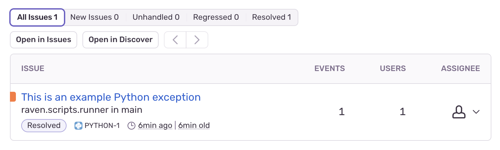

# Домашнее задание к занятию 16 «Платформа мониторинга Sentry»

## Задание 1

  

## Задание 2

1. Создайте python-проект и нажмите `Generate sample event` для генерации тестового события.  
2. Изучите информацию, представленную в событии.  

  

3. Перейдите в список событий проекта, выберите созданное вами и нажмите `Resolved`.

  

4. В качестве решения задание предоставьте скриншот `Stack trace` из этого события и список событий проекта после нажатия `Resolved`.

  

  

## Задание 3

  

